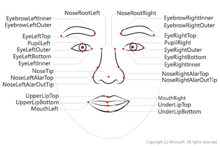

# Tips for more accurate results 

There are some considerations that can help improve the accuracy of the detection in the images: 
* image format - supported images are JPEG, PNG, GIF, and BMP 
* file size - 6 MB or smaller 
* face size range - from 36 x 36 up to 4096 x 4096. Smaller or larger faces will not be detected 
* other issues - face detection can be impaired by extreme face angles, occlusion (objects blocking the face such as sunglasses or a hand). Best results are obtained when the faces are full-frontal or as near as possible to full-frontal.

## Facial analysis 

Moving beyond simple face detection, some algorithms can also return other information, such as facial landmarks (nose, eyes, eyebrows, lips, and others). 

Algorithms such as the eigenface algorithm, and distribution-based algorithms such as the fisher’s discriminant and the PCA. 

There are many applications for face detection, analysis, and recognition. For example, 

* Security - facial recognition can be used in building security applications, and increasingly it is used in smart phones operating systems for unlocking devices. 

* Social media - facial recognition can be used to automatically tag known friends in photographs. 

* Intelligent monitoring - for example, an automobile might include a system that monitors the driver's face to determine if the driver is looking at the road, looking at a mobile device, or shows signs of tiredness. 

* Advertising - analyzing faces in an image can help direct advertisements to an appropriate demographic audience. 

* Missing persons - using public cameras systems, facial recognition can be used to identify if a missing person is in the image frame. 

* Identity validation - useful at ports of entry kiosks where a person holds a special entry permit. 

## Knowledge check 
#### 2 minutes 

* You plan to use Face to detect human faces in an image. How does the service indicate the location of the faces it detects? 
  * A pair of coordinates for each face, indicating the center of the face
  * Two pairs of coordinates for each face, indicating the location of the eyes 
  * A set of coordinates for each face, defining a rectangular bounding box around the face 

* What is one aspect that may impair facial detection? 
  * Smile expression
  * Extreme angles 
  * Fast shutter speed 

* You want to use Face to identify named individuals. What must you do? 
  * Use the Computer Vision service - Face cannot perform facial recognition
  * Use Face to retrieve age and emotional state for each person 
  * Use Face to create a group containing multiple images of each named individual, and train a model based on the group 

* What are the different face detection algorithm used? 

* List the tips to help improve the accuracy of face detection and applications of face detection  

## Create a Cognitive Services resource 

You can use the Face service by creating either a **Face** resource or a **Cognitive** Services resource. 

If you haven't already done so, create a **Cognitive Services** resource in your Azure subscription. 

In another browser tab, open the Azure portal at https://portal.azure.com, signing in with your Microsoft account. 

Click the **＋Create a resource** button, search for Cognitive Services, and create a **Cognitive Services** resource with the following settings: 

**Subscription**: Your Azure subscription. 

**Resource group**: Select or create a resource group with a unique name. 

**Region**: Choose any available region: 

**Name**: Enter a unique name. 

**Pricing tier**: S0 

**I confirm I have read and understood the notices**: Selected. 

Review and create the resource, and wait for deployment to complete. Then go to the deployed resource. 

View the **Keys and Endpoint** page for your Cognitive Services resource. You will need the endpoint and keys to connect from client applications. 

## Run Cloud Shell 

## Configure and run a client application 

Now that you have a custom model, you can run a simple client application that uses the Face service. 

1. In the command shell, enter the following command to download the sample application and save it to a folder called ai-900. 

git clone https://github.com/MicrosoftLearning/AI-900-AIFundamentals ai-900 

 

While the Computer Vision and Video Indexer services offer face detection features, the Face service and associated APIs provide more capabilities. Which you should choose will ultimately depend on the insights you want to gain from facial detection. If you want to look for data around facial landmarks, Face is the proper choice. 

You can find out more about Face in the service documentation. 

 
### References  

 https://www.pngitem.com/middle/oihToT_security-svg-png-icon-free-download-security-icon/ 

 

https://www.flaticon.com/free-icon/social-media_4187236 

 

https://iconscout.com/icon/mouth-publicity 

 

https://thenounproject.com/browse/icons/term/missing-person/?iconspage=1 

 

https://www.onlinewebfonts.com/icon/328611 

 

https://www.kelsiem.com/intelligent-security-monitoring
 

 

 
